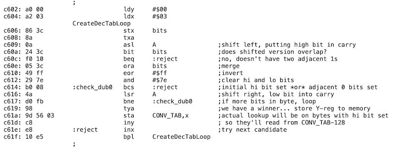

# 不可思议的 ***Disk II*** 控制卡

2021年11月12日 | 分类：“位桶”系列，软驱模拟，“黄石” 磁盘控制器| 作者：史蒂夫

原文：https://www.bigmessowires.com/2021/11/12/the-amazing-disk-ii-controller-card/

在 ***Apple II*** 的磁盘世界中，主要有两种磁盘控制卡：原版 ***Disk II*** 控制器（及其克隆产品），以及其它种类。这两类控制卡在市场上各有立足之地。上述的“其他种类”包括了苹果的3.5英寸磁盘控制卡、***Liron*** 卡、SCSI卡、IDE卡等等。这第二类控制卡为软件读写块、获取驱动器状态以及格式化磁盘等操作提供了一套标准的API（应用程序接口），以此向软件隐藏磁盘工作的细节。它们都非常聪明，采用了内建机制来帮助处理那些底层细节。 ***Disk II*** 控制卡则大为不同，它没有那样的“智能”，而是强制软件以一种虚拟的方式来处理基本的控制。尽管如此，它却是当年技术领域的一块亮眼的宝石。

***Apple II*** 计算机的最初型号并没有集成对软盘的支持，而 ***Disk II*** 控制卡则以低廉的成本、精巧的设计，为计算机扩展了这项原本没有的功能。这在很大程度上导致了 ***Apple II*** 计算机的流行。相比于同时代的其他控制卡产品，它更简单、更便宜，也更加灵活，全方位碾压了一众竞品。这是沃兹尼亚克创造精神的终极范例。

## 软盘基础知识

软盘实际上就是一个表面覆盖有磁性材料的塑料圆片。将软盘插入到驱动器后，盘片就会以每分钟300转的速度旋转起来。一个步进电机带动读写头直线运动，从盘片中心移动到盘片的外圈。这种运动方式下，读写头在盘片表面的轨迹是许许多多的同心圆。一串串由二进制位1和0来表示的数据对应不同的磁化状态，被存储在这些圆上。

要如何从以上基本原理出发，掌控字节、磁道和扇区这些更高层次的概念呢？逻辑数据中的众多字节如何被编码成特定的位模式，从而存储在磁盘上？当读取磁盘时，这些二进制位如何重组为字节？如何找到0号磁道，又如何寻找扇区之间的边界？在20世纪70年代，以上问题的常见回答是使用许许多多的额外的硬件。这导致了磁盘控制器和驱动器本身结构复杂且价格不菲。对于廉价的家庭计算机系统，这样做显然会使得系统超出绝大多数家庭的经济承受能力。

在1977年末，苹果公司着眼于寻找一种磁带数据存储的替代品。他们开始为 ***Apple II*** 计算机寻找和设计合适的软磁盘驱动器方案。当时苹果公司还是一家名不见经传的小公司，***Apple II*** 计算机也仅仅面世6个月。对于软盘，沃兹尚且知之甚少。尽管如此，他接下了这个挑战。

沃兹的方案是移除所有对于控制磁盘不必要的硬件，使用一种软件驱动的，类似“位拆裂”（bit-banging）的方式替代（译者注：嵌入式MCU开发者常用的在普通GPIO上使用软件模拟$I^2C$控制器就是一种“位拆裂”技术）。 苹果找到了5.25英寸软盘驱动器的发明者舒加特（Shugart）公司，请他们定制了自家SA400驱动器的阉割版本。他们移除了其中大部分控制电路，基本上只剩下简单的机械机构、一个转动盘片的主轴电机、以及移动读写头的寻道步进电机。传奇拉开大幕。***Disk II*** 系统的硬件设计被确定下来。沃兹和兰迪·威金顿（Randy Wigginton）在1977年圣诞节假期期间用了几周的时间搭建了整个系统，并完成了第一版磁盘操作系统（DOS）的编写。能正常工作的的磁盘驱动器被拿到了1978年1月的CES（国际消费类电子产品展览会）上展示。期间，苹果的工程师克里夫·休斯顿（Cliff Huston）和温戴尔·桑德（Wendell Sander）提供了一些帮助。40多年后的今天，我仍然惊叹于这个小团队居然在如此短的时间里就让磁盘系统运行了起来。

几年前我就 ***Disk II*** 系统的研发采访了沃兹本人，他说道：

> 我不清楚当时自己是如何想到这个精妙绝伦的磁盘控制器设计的。我擅长创造电子方面的东西，无论是模拟的还是数字的。我先前没有关于磁盘软硬件的任何经验，甚至在课堂上都没有了解。当时我的一切想法不得不从零开始。我需要使用磁头探测磁盘上的数据，然后使用探测到的0和1根据时序来做决策。
>
> 我之前在伯克利上过一门本科生课程，这门课讲了状态机相关知识，以及使用两片简单且低成本的芯片做一个状态机的思路，最终实现一个手工制作的极简的微处理器。顺带一提，虽然是本科生，我只上过一切大学的一切和计算机相关的本科生课程（并不包括电子等专业）。我需要承认的是，在当时我刚刚了解到读写数据的需求，却因为对磁盘控制器行为的不了解，遗漏了很多设计上必须考虑的因素。我的设计非常简陋，用了非常少的部件，这很明显是没有经验。不过到最后，我的设计确实也作出了许多积极的贡献。尤其重要的一点是，这款磁盘控制器用在计算机上，因此不得不牵扯到软件，而软件的工作方式又是灵活多变的，通过软件修改很容易做到更大容量的存储和更快的速度，这对于普通（完全基于硬件的）磁盘系统来说难以做到。除此之外，我将大约20片芯片从驱动器本体中拿掉，再使用我的控制卡设计避免使用它们。我的设计中这些芯片完全就是碍事的“中间人”。
>
> 多年来我最得意的工作，都是在资金不足的条件下学习使用最少的部件来实现功能促成的，并且应当归功于“前无古人”的创新精神。

## ***Disk II*** 控制器揭秘

***Disk II*** 控制卡基本上就是一个新颖的移位寄存器。它知道如何以每4 us一个二进制位的固定速率从/向磁盘上读/写位。 控制卡还包含一片256字节大小的只读存储器（ROM），在其中存放着计算机冷启动后会首先执行到的引导代码。这是一段极其短小的6502程序，却能完成定位0磁道、0扇区并将此处的数据读进内存并执行的任务。此后，更复杂的磁盘控制的工作全权交给加载进RAM的程序负责。

控制卡包含了8片简单的芯片。一片256字节的ROM用于存储引导代码。另一片256字节的ROM被用作状态机的一部分（查表得到状态转移，稍后会详细介绍）。另外有一片六D触发器 74LS174 为状态机提供输入（时序逻辑中当前状态的锁存）。一片八位的移位寄存器（串-并互转） 74LS323 是整个设计的核心。 一片八位可寻址锁存器（八位独立输出，但只有一位输入，使用三位地址线来寻址八个一位的触发器） 74LS259 用于存储电机所需的状态和1号-2号驱动器选择信号。除此之外还有一片双定时器 556（提供4 us的位时间基准），一片六反相器 74LS05 和 一片四双输入与非门 74LS132 提供了其他必须的胶合逻辑（即组合逻辑，起到粘合逻辑电路各部分的作用）。整张卡只有这些芯片。下面是原理图：

让我们来看一看磁盘I/O系统设计中的若干挑战，并了解 ***Disk II*** 控制器的设计是如何逐一击破这些难题的吧。

### 挑战一：字节的定界/成帧问题

来自磁盘的数据是由一连串二进制0和1组成的流，在其中是不包括起始位和停止位的。 我们该如何找出某一字节的结束和下一字节的开始的位置呢？沃兹的解决方案强制规定写入磁盘的每一个字节的最高有效位（MSB）必须为二进制的1。在读取磁盘的过程中，状态机一次吞掉读来的一个比特，之后将移位寄存器中的内容向右移动一位，再把新读取的那个比特拼接在最右边。如此往复，直到移位寄存器最左边的那一位变成二进制的1才停下来，这指示状态机一个完整的字节被读取到了。CPU会取走并存储读到的这一字节数据，这样状态机就可以重复以上过程来继续控制磁盘读取。状态机在移位寄存器的最高有效位变成1后会将移位寄存器清零，以准备移入接下来的一个字节中的八个比特。

然而，这种方案并不是完备的。如果状态机碰巧从某一个字节的中间开始阅读，它就会将字节中段的一个二进制数据位1误当做最高有效位强制规定的那个1。但是此方案可以保证的是，如果状态机在某种机缘巧合或是其他机制下正确组装了一个字节，那么接下来的字节都将是正确的。现在，问题就转变为设计一种能在磁盘读操作开始前保证字节成帧无误的机制。

针对于此，一种常见的做法是向磁盘中每个扇区数据的前面写入一串被称为“同步字节”的，由50个二进制位组成的特殊序列。 “同步字节”有别于常规字节，它是由10位序列“1111111100”重复五次构成的。这个10位的序列有个有趣的特性，那就是按照以上所述的字节组装机制，无论字节组装的起始位置定在哪里，总能在这个10位序列重复出现至多五次后找到正确的字节起始位置。这个经典到被作为惯例的方法完全是基于软件实现的。硬件不包含确保字节成帧正确性的机制。当然，字节正确成帧的方法远远不止有这一种，在一些游戏中，开发者通过自编输入输出子程序，实现了丰富而多样的字节成帧方案，***Apple II*** 那些五花八门的磁盘防拷贝机制应运而生。

译者注：这种特殊的“同步字节”设计的基本思想是什么呢？观察发现，这个10位序列是由一个全1的字节（十六进制表示为`FF`）加上两个0构成的。可以思考一下第一种情况，如果起始时读取的位恰好是两个0中的某一个，上面的状态机设计会使得0从移位寄存器的最高有效位“溜走”，读到的字节不含有0，是`FF`。并且，五个字节都读到`FF`，第五个10位序列的最后两个0同样会“溜走”，有效数据第一个字节的最高有效位1会顺势进入移位寄存器，这就完成了同步（字节对准）。而第二种情况，如果起始时读到的是`FF`部分中某个1，两个0必定出现在移位寄存器里的那个字节中。“同步字节”以10位为一个循环周期，而移位寄存器中的字节以8位为一个循环周期，二者每周期中的比特数并不相同，一快一慢产生“追赶”的效果，类比编程中常用技巧“快慢指针”，导致了连续读若干个字节，读到的数据也不尽相同。“追赶”效果其实相当于一字节长度的滑动窗口在10位的同步序列单元上滑动，由最小公倍数的关系，状态机在进行最多5轮的读字节操作后，滑动窗口必定“追上”或者说“套住”`FF`的部分，完成同步，转化为第一种情况。

### 挑战二：字节的编码问题

如果强制了字节的最高有效位为1，那么原来的全0字节该如何写入呢？那些小于128的数值是不是也不能表示了？此外，我们必须要保证写入磁盘的每个字节中不能出现多于2个的连续的比特0。比如说，如果有连续的3个比特0，磁盘驱动器的硬件将无法可靠地读回数据。鉴于以上两条限制，一个字节的8位天然形成的256种可能的取值中，只有66种可行的取值被允许写入磁盘。 我们该怎样将一个任意的8位数存入磁盘呢？

答案是将逻辑上8位长的字节拆开，将拆开后的位分组放入多个物理字节里。一种标准做法是使用叫做“6-2编码”的成组编码模式（GCR）。在约束下，66种可写入磁盘的数值中，选择两个值（`AA`和`D5`）作为保留值，其余64个可以拿来编码数据。64是2的6次方，这表明有6个逻辑比特可以被编入一个磁盘上存储的物理字节。连续三个物理字节被拿来编码连续三个逻辑字节各自的前六个比特，第四个物理字节用来编码这三个逻辑字节最后两位拼接在一起表示的六比特数据。在不考虑可能存在的头结构、校验和以及填充的情况下，磁盘上存储的物理字节数量是表示有效数据的逻辑字节数量的4/3倍。

您可能好奇 ***Disk II*** 磁盘控制器的引导代码是怎样实现0磁道、0扇区中成组编码数据的解码的。最直接的想法可能是在ROM中存储一个有64个表项的反向查找表。不过，这会直接占据本就非常有限的ROM空间的四分之一。实际上，引导代码使用了一个更加讨巧的方法，那就是在运行的过程中在内存中实时地构建一个具有256个表项的正向查找表（[点击](https://6502disassembly.com/a2-rom/C600ROM.html)查看汇编代码清单），构建查找表的6502代码只占用了30个字节的空间！

***Apple II*** 软盘的字节编码方案迭代了多次，这导致磁盘扇区数和总容量随之发生变化。初版的 ***Disk II*** 磁盘控制器不允许任何形式的连续比特0被写入磁盘中。这进一步限制了磁盘所能容纳的字节数，迫使我们采用一种更为低效的“5-3编码”的编码模式。每个磁道只能容纳13个扇区，这样整张磁盘的容量就是114 KB。Apple DOS 3.1 和 3.2 就采纳了“5-3编码”。 最终沃兹或是他的团队成员意识到对状态机做一些微小改动，就可以可靠地读出连续两个比特0。需要做的只是改变状态机ROM中的内容，修复一个关键的小漏洞，使得对位时序的测量更加精准可靠。这并不需要对 ***Disk II*** 控制卡做任何硬件上的修改。更加高效的“6-2编码”从 Apple DOS 的 3.3 版本被引入，带来了16扇区磁道和更大的140K整盘容量，这正是现在我们所熟悉的情况。

我们看到在字节编码问题上，上述方案完全是由软件实现的，并没有必要设计任何硬件来实现“6-2编码”“5-3编码”或是其他的编码方案。0磁道的0扇区必须采用“6-2编码”来写入，这是ROM中固化的引导代码所需要的编码模式。在引导后，我们就可以使用任何自定义的字节编码方案了。软件可以自由选择编码模式，很多带有防拷贝功能的软件也通过使用新颖的字节编码来“混淆”被保护的部分。

### 挑战三：扇区的划分问题

我们将来自驱动器的比特流正确组装形成物理字节，再将物理字节正确解码得到逻辑字节，我们该如何理解这里得到的数据呢？没错，同一磁道得到的逻辑字节序列正如同一个环形缓冲区。对于首尾连接的字节流，我们该如何找到数据的起始？20世纪70年代的软盘通常在盘面的圆周上等间隔打出一个或多个用来索引的小孔。软盘防尘套被切开一个窗口，当盘面的小孔从下方经过时便会从窗口漏出。磁盘驱动器内部的硬件能检测在盘片旋转时，小孔何时经过窗口。小孔经过窗口的信息被用来找出新的磁道或新的扇区的起始位置。

我们很容易理解为何这种方式没有被采用。检测孔的硬件引入了额外的复杂性并增加了成本。如果使用了每个扇区都打孔的“硬扇区”方案，扇区的数目就成为了硬件设计的一部分而不再可变。 苹果将13扇区格式改为16扇区格式的行为在“硬扇区”设计下也不再可行。

***Disk II*** 磁盘系统采用了一种软件驱动的扇区分划设计。盘面上的任何索引孔都将被无视。当需要在当前磁道找到特定扇区时，计算机便开始读取字节，丢弃收到的一切数据，直到找到三字节序列`D5 AA 96`。这个三字节的“签名”标志着磁盘上一个新扇区的起始。这或许是一众 ***Apple II*** 秘辛中最被人津津乐道的序列。在我的办公室墙上挂着一片5.25英寸软盘，上面就有沃兹亲笔签下的`D5 AA 96`：

在这个三字节的“签名”后有一个短小的扇区头，其中含有最为重要的扇区号信息。如果扇区号与计算机正在寻找的扇区匹配，就会继续读取之后的字节。如果不是正在查询的扇区，则继续寻找下一个指示扇区起始的“签名”`D5 AA 96`，并再次做扇区号比对尝试。

总而言之，和上文一样，这也是个纯软件实现的方法。无论是`D5 AA 96`这个“签名”，扇区头结构，还是扇区的长度之类的东西，都仅仅是一种基于软件的协定。并且 ，***Disk II*** 控制器硬件并不会限制软件使用某种特定的方法来处理这些难题，因此很多软件也采取了非同寻常的方法。一个广为人知的案例是游戏《波斯王子》（Prince of Persia），它使用了一种被叫做 [RWTS18](https://fabiensanglard.net/prince_of_persia/pop_boot.php) 的自定义方案，以损失写性能的方式对读操作进行针对性优化。同时，它每个磁道有6个768字节的扇区，和标准的6个256字节扇区的做法也是不同的。

译者注：为什么要使用`D5 AA 96`作为“签名”呢？细心的读者可以发现，`AA`和`D5`是上文所述的“6-2编码”的保留值，不用来表示有效数据。

### 挑战四：寻道问题

到目前为止，我们仅仅讨论了存储在磁盘某一个同心圆环上的数据。这些圆环被称为磁道，不过一条磁道应该包括哪些部分可能还尚不明晰。如此一来该如何在磁道间切换，或是定位某一个特定的磁道呢？盘片上总共有多少条磁道？***Disk II*** 的硬件不会回答这些问题。这一切，全  部  都  是 软件驱动的。

在磁盘这种介质上，实际上并不存在看得见摸得着的磁道。磁盘本身就是一个普普通通的磁介质圆片。当读写头保持在一个固定的径向位置，盘片旋转起来，比特被写入的时候，磁道就形成了。磁头内外移动来到一个新的径向位置，再写入一个新的磁道。

读写头的移动受到一个步进电机的驱动，而这个步进电机是由软件直接控制的。步进电机内部由4个电磁铁组成，在任何一个时刻软件都可以将它们之中的任意一个或几个加电或者掉电。一组永磁铁依附在驱动读写头运动的齿轮边缘。通过以正确的顺序激活电磁铁，就可以吸引或排斥永磁铁，使得磁头移动起来。如果步进电机的零号电磁铁打开，接下来一号电磁铁也打开，最后零号电磁铁关闭，磁头就能移动一个很小的径向距离（称为一步）。此后，如果二号电磁铁打开，再关闭一号电磁铁，磁头将会继续沿同一个方向运动。

磁道之间究竟可以排布地多近呢？实际上，需要使得磁头向同一方向移动两步，以确保磁头移动了足够远的距离，不至于造成新磁道与邻近磁道的干扰。如果尝试将磁头仅移动一步就读写新数据，磁介质上邻近磁道的磁化区域就会彼此混合，造成记录内容的混乱。因此，磁头动作两步通常被等同为一条磁道，动作一步相当于移动了半条磁道。四分之一磁道同样是可能的，只不过大部分软件并不会使用到。如果零号电磁铁加电，同时一号电磁铁也加电，磁头就会移动四分之一条磁道（半步）。此时如果关闭零号电磁铁，磁头会继续向同方向移动四分之一个磁道。

定位0磁道的手段就很暴力了。磁盘控制器并不知道当前磁头位于哪一条磁道，因此软件必须连续激活步进电机驱动磁头向0磁道的方向移动。最后，磁头将到达0磁道的位置，并卡在那里无法继续移动。然而，软件会继续激活步进电机，驱动磁头顶在机械限位块上，产生 ***Apple II*** 软驱启动时那令人熟悉的刺耳声音。在移动80个半步之后，可以保证磁头一定位于0磁道处。在此之后，软件就需要密切追踪磁头的每一步移动，记录下磁头当前所处的位置，来帮助进行相对的寻道动作。如果读写期间软件发现了令其困惑的情况，比如在其认为是第20条磁道的位置却读到了另一条磁道的数据，软件通常会进行重校准操作，即把磁头移回0磁道，紧接着再步进回到其所读写的磁道处。这时，软驱会发出咔咔声，一些资深 ***Apple II*** 用户会将其视为磁盘损坏的征兆。

一般来说，一张磁盘上会存储35条磁道，但这也仅仅是个惯例。实际情况随着驱动器的不同而不同，并且是由读写头的最大和最小的线性位置所决定的。有时也能见到多达40条磁道的非标准磁盘。

带有防拷贝机制的 ***Apple II*** 游戏常常会使用一些关于磁道步进的有趣技巧。一个简单的技巧是将磁道定位在距离0磁道奇数个半步长的位置上。磁道间至少要相隔两个半步长，但没有规定磁道间距不可以是三个半步长。因此，可以见到某些游戏的磁盘将数据存储在第0、1、2.5和第4条磁道上。这将扰乱那些只能在整数磁道上读写的磁盘拷贝软件。

一种更加高级的技巧是在相邻仅仅半步的磁道上写入数据，但每个磁道只使用半个圆周，这样磁化区域间将不会重合并互相影响。比如，第2条磁道只有从十二点钟到六点钟方向的一半写有数据，第2.5条磁道则只在从六点钟回到十二点钟的另一半上写有数据。以这种方法写入的数据很容易读出，但如果没有特别编写的子程序，则很难写入，使得磁盘的拷贝变得困难很多。

## 对引导代码的反汇编

对256字节的[引导子程序](https://6502disassembly.com/a2-rom/C600ROM.html)的反汇编和分析过程非常精彩。在开机以后一无所有的境地，这段代码需要直接控制“软开关”来移动步进电机和读取移位寄存器。它需要以正确的顺序激活步进电磁铁来使磁头抵达0磁道，并开始读取字节。它还需要识别出`D5 AA 96`的“签名”，并检查是否读出合适的扇区。它必须使用运行时构建的GCR解码表来转换物理字节，执行“6-2编码”的解码来将四个物理字节重建为三个逻辑字节，将整个扇区读入内存缓冲区，并执行跳转把控制权交给刚刚读入的代码。然而实现这一切仅仅用了256字节的引导代码！

沃兹完成以上工作时还留有五个字节的节余，大概只用了100行的6502汇编代码。然而由于ROM空间的限制，一些特性没有被实现。***Disk II*** 控制器的引导代码没有检查0扇区数据的校验和，在后期的磁盘控制器上这个问题被“修复”了，却造成了一些游戏的不兼容问题。错误处理也没有被实现，启动代码将会一直尝试装载0扇区。这也解释了为什么插有 ***Disk II*** 扩展卡的 ***Apple II*** 电脑在没有磁盘插入驱动器或是插入损坏的磁盘时，系统启动过程会卡死，而不是像***Apple IIc*** 或是 ***IIgs*** 电脑那样显示对用户友好的错误信息。

## ***Disk II*** 控制器的硬件设计

以上讨论聚焦于 ***Disk II*** 控制器的行为，却没有探讨更多准确的实现细节，也没有解释八片芯片的工作方式。对于想要透彻、深入地了解其实现的朋友，我建议阅读吉姆·萨瑟（Jim Sather）编著的[《理解Apple II》](https://archive.org/details/understanding_the_apple_ii/page/n229/mode/2up)一书的第九章。其中阐述了有关磁介质的磁通量分布等有关磁盘的更多信息。

状态机的设计非常有趣，除了萨瑟的书以外，我并没有见到有人描述过它。如果您还记得很早以前在课堂上学习过的关于摩尔型和米勒型时序逻辑电路的知识，那么就可以识别出沃兹的工作。状态机的ROM仅仅是一个查找表，它的输入为当前状态、读/写模式、移位寄存器的最高有效位和来自磁盘的下一个比特，输出是下一个状态以及一组控制信号。根据控制信号的不同，状态机可能执行将移位寄存器中的值进行移位操作并附加一位0或1，清空移位寄存器，或是从数据总线将数据并行装入移位寄存器的操作。

状态的编码是精心挑选的，使得状态编码中的位可以被同时用作控制。比如说，当向磁盘中写入数据时，写入磁头的位同时也是当前状态编号的最高有效位。当从磁盘读取数据时，选取状态序列的原则是将对应于比特1的位输入脉冲嵌入一个4us的位时间窗口，并且当持续1.5个位时间窗口（即6us）没有接收到输入脉冲时就插入一个比特0。在我的名为“黄石”的基于FPGA的磁盘控制器中，我用一百行的Verilog代码实现了与之等价的功能，而沃兹使用了一片256字节的ROM和一个六位触发器。

## 总结

“软件驱动的”这个词汇在这里一遍又一遍地出现，它是 ***Disk II*** 控制器设计的精髓。这让我们可以使用最小化的硬件实现灵活的设计，但也使软件变得非常复杂。现代的软件设计者往往会对这种做法嗤之以鼻，他们更想看到这种复杂性被一套标准接口隐藏，软件只需要关心诸如“读31号块”这样的动作即可，这也正是其他的 ***Apple II*** 磁盘控制器的工作方式。当与 ***Disk II*** 控制器配合工作时，那些软件如DOS 3.3、ProDOS和大多数游戏，都需要大量的额外代码来操控步进电机，定位扇区，执行GCR解码，无所不包。虽然有些疯狂，但的确管用。

如果您读到了这里，您或许对 [BMOW Floppy Emu](https://www.bigmessowires.com/floppy-emu) 这款磁盘模拟器感兴趣。对老 ***Apple II*** 电脑、麦金塔电脑或是 ***Lisa*** 电脑的收藏者来说，它将会对运行从网上下载的软件非常有帮助，并可以在古董电脑和现代电脑间交换文件。它可以把数百个磁盘镜像存储在TF卡里，使用特殊的硬件来模仿不同种类的Apple软驱和硬盘。在 [这里](https://www.bigmessowires.com/floppy-emu)可以获取到关于它的更多信息。

十多年以来，我花了很多时间找寻关于Apple磁盘驱动器设计的各方面资料，这真是一个奇妙的旅程。 几年前我常常以为我完全理解了它工作的方式，但现如今我才知道当时的我一无所知。我现在相信把一切都规划好了。不过自然，我的理解可能仍然存在未能认识到的不足之处。在这里我有错误解释什么东西吗？又或者忘记提到哪些重要的事物？请在评论区多多指教！